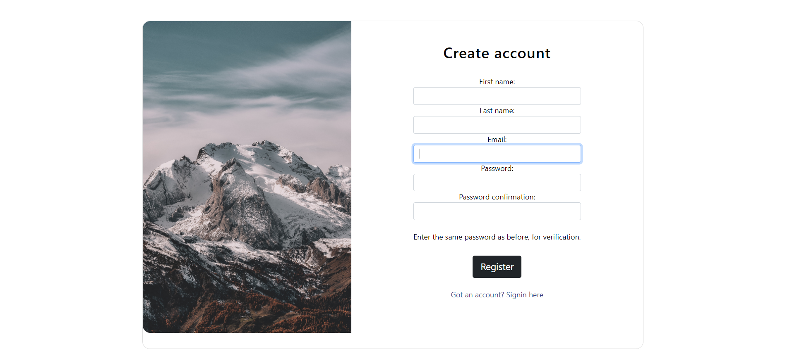
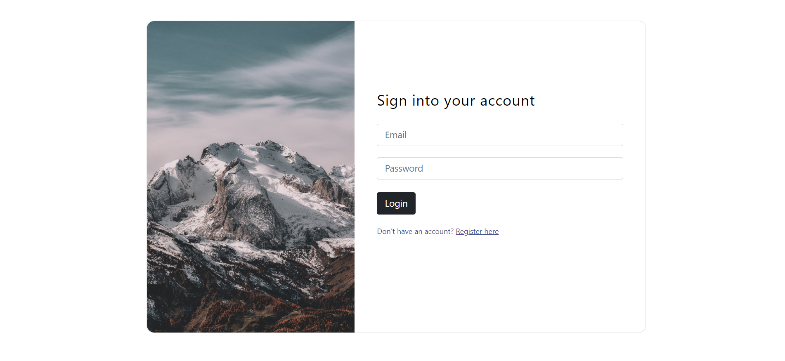
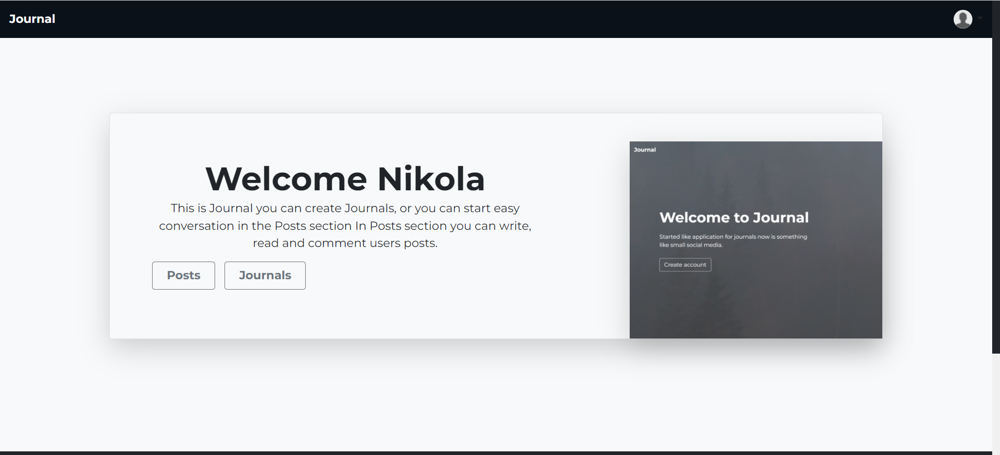
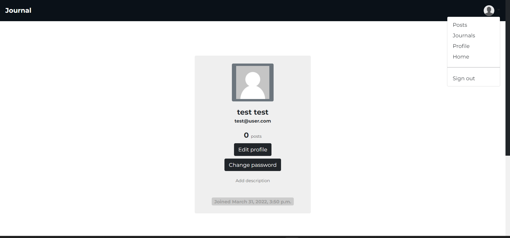

<h1>Journal</h1>

Link to the project: <a href="https://journal-a.herokuapp.com/">Journal</a>

 -email: test@user.com 

 -password: qV~!8x>>L# 

Welcome page

Register page

Login page

Home page

Profile page

-You can create journals

-You can create public posts, comment them and like them

There are 'staff' they can't post comment or create journals but
they can ban users from posting and commenting. They have a special dashboard for 
that. You can only see it if you have staff permission!

If you want to test the app use:
